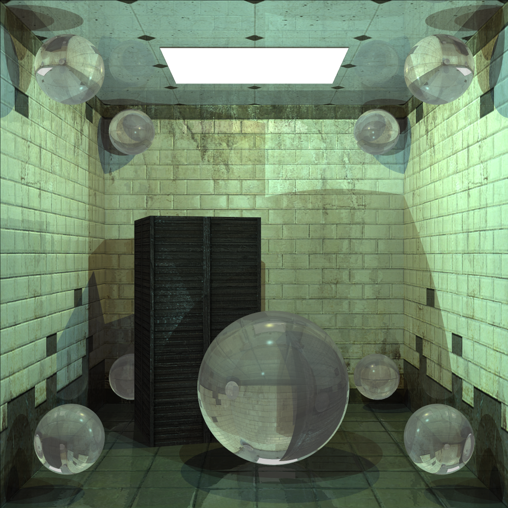
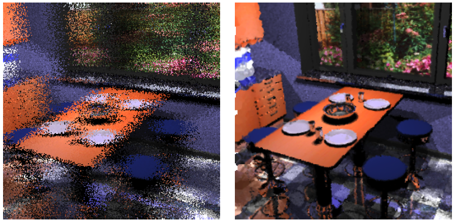

# HassaAFR — Adaptive Frameless Rendering

A C++ demonstrator for **adaptive frameless rendering**: a real-time display technique
that continuously updates individual pixels from a stream of ray-traced samples instead
of redrawing the screen frame by frame. Master's thesis project, FIT BUT, 2012.



## About

In conventional real-time rendering the image is produced one whole frame at a time and
swapped to the screen through a double buffer. **Frameless rendering** drops the frame:
samples are computed in a randomized order across the image plane and written to the
framebuffer the moment they are ready, so the displayed image is always a temporal mix of
old and new information. This lowers latency but adds noise.

The thesis studies the **adaptive** variant, which spends its sample budget where it
matters. Three stages build on each other:

1. **Basic frameless rendering** — samples are placed with a low-discrepancy sequence
   (Halton) rather than uniformly at random.
2. **Guiding sampling** — the image plane is split into a grid of tiles; a per-tile
   probability derived from spatial/temporal image derivatives and a pixel "aging"
   function steers more samples toward regions that are changing or under-sampled.
3. **Reconstruction** — a sparse set of samples is filtered into a full image using an
   anisotropic filter whose spatial and temporal extent adapts to local image gradients,
   so edges and motion stay sharp while flat regions are smoothed.

This repository is the demonstration application written for the thesis, plus the thesis
text, user guide, result images and supporting materials. The sampling / tiling /
reconstruction pipeline is the core of the work; **OpenGL and GLUT are used only to open
a window and blit the framebuffer** — all rendering is done on the CPU by a raytracer
written from scratch.

The reconstruction step benefited from advice by Thomas Schlömer; the technique overall
follows the frameless-rendering literature (Bishop et al., Dayal et al.).



*Left: raw frameless samples at a low sample count. Right: the same data after adaptive reconstruction.*

## Status

**Archived / not maintained.** Built in 2011–2012 as a master's thesis and frozen since.
It is published here for reference and as a portfolio piece, not as a library or an
actively developed tool. Expect 2012-era C++ (raw `new`/`delete`, `throw` specifications,
MinGW/GCC 4.6).

## Features

- CPU raytracer: spheres, cones, cylinders, polygons, triangles and triangle meshes;
  point and area lights; ambient term; recursive reflection/refraction; optional
  **kd-tree** acceleration with an automatic ("smart") depth heuristic.
- Custom **AFF** scene format — an extension of Eric Haines' NFF (Neutral File Format)
  adding materials, textures, triangle meshes, keyframe animation and animated
  transforms/lights.
- Six sample-position strategies: random, Halton sequence, jittered, multi-jittered,
  Poisson-disk, N-rooks.
- Adaptive **guiding sampling** over a configurable tile grid, driven by Sobel-based
  spatial/temporal derivatives and a tunable aging factor.
- Adaptive **image reconstruction** with a Gaussian filter whose volume adapts via a
  sigma factor.
- Auxiliary visualisation buffers: tile probabilities, full derivatives, temporal
  derivative.
- INI configuration file plus equivalent command-line overrides; frame capture to PPM
  with a configurable filename mask.
- Three build targets sharing one codebase (see below).

### The three applications

| Binary       | Purpose | Settings |
| ------------ | ------- | -------- |
| `afrSim`     | **Simulator** used for the measurements in the thesis. Simulates animation time and generates a fixed number of samples per step ("zero-latency" renderer). | Fully configurable |
| `afrDemo`    | **Demonstrator**. Adds interactive controls — switch sampling method, toggle guiding sampling and reconstruction at runtime, show helper buffers. | Fully configurable |
| `afrFull`    | **Final application**. Fixed "best" configuration (Halton + guiding sampling + reconstruction), not changeable at runtime. | Minimal |

## Tech stack

- **C++** (C++03), built with **MinGW / GCC 4.6.1**; also compiled on the FIT "Merlin"
  Linux server.
- **OpenGL** + **GLUT** (`glut32` / freeglut) for window and framebuffer display only.
- Plain **Makefiles** (recursive), one per module.
- **Doxygen** for API documentation.
- **LaTeX** for the thesis (`fitthesis` class), compiled on Merlin.
- No third-party libraries in the source tree.

## Downloads

To keep the repository small, large binary material that shipped on the original thesis
DVD is published as **release assets** rather than committed to the tree. See the
[Releases page](https://github.com/vojtech-krupicka/fit-afr-dip/releases):

| Asset | Contents |
| ----- | -------- |
| `afr-compiled.zip` | Pre-built Windows binaries (`afrFull` / `afrDemo` / `afrSim`) with `config/`, `scenes/` and launch `.bat` files |
| `dlls.zip` | Third-party runtime DLLs for the Windows binaries (GLUT, MinGW, etc.). These retain their own licenses — see the note under [Building](#building). |
| `vol1_HD.mp4`, `vol2_HD.mp4` | Demonstration videos (1024×1024, H.264) — vol. 1 is the bouncing-ball scene, vol. 2 covers Planet Earth and the pawn |

The pre-built binaries target a 2012 Windows toolchain and are provided as-is for
archival interest; building from source is the supported path.

## Building

Requirements: a C++ compiler (GCC/MinGW 4.6-era), `make`, and OpenGL + GLUT development
headers/libraries.

```bash
cd Source
make            # builds all three: afrFull, afrDemo, afrSim
# or individually:
make full
make demo
make sim
make docs       # Doxygen HTML (needs doxygen)
make clean      # remove build products
```

Binaries are written to `Source/bin/`. On Windows you may need the matching GLUT /
runtime DLLs on your `PATH`. The original build was done with MinGW 4.6.1 on Windows 7
and on Linux (Merlin); it has **not** been re-tested on modern toolchains and will
likely need small fixes to compile with a current GCC/Clang.

> The pre-compiled Windows binaries and their bundled DLLs that shipped on the thesis DVD
> are attached to the [latest release](https://github.com/vojtech-krupicka/fit-afr-dip/releases),
> not committed to the tree. The DLL bundle includes GPL-licensed runtime libraries
> (`cygwin1.dll` and others), which retain their own licenses and are not covered by this
> repository's MIT license.

## Usage

```bash
# scene file is the only required input
./afr -s scenes/bball.aff

# configure from an INI file (which may itself name the scene)
./afr -c config/full_bball.ini

# INI file plus an explicit scene (command line wins over the INI)
./afr -c config/sim_bball.ini -s scenes/earth.aff

# ad-hoc overrides, key=value, no spaces around '='
./afr redraw_mode=fixed redraw_fixed=4500 scene_file=scenes/pawn.aff

./afr -h        # help
```

Batch scripts that run each application over the test scenes with several settings are in
`Source/bat/` (`demo.bat`, `full.bat`, `sim.bat`); press `ESC` to end the current scene
and continue to the next.

### Interactive controls (`afrDemo`)

| Key | Action | Key | Action |
| --- | ------ | --- | ------ |
| `F` | toggle fullscreen | `1`–`6` | sample method: random / Halton / jitter / multi-jitter / Poisson / N-rooks |
| `G` | toggle guiding sampling | `SPACE` | play / pause animation |
| `R` | toggle reconstruction | `HOME` / `END` | jump to start / end of animation |
| `B` | cycle helper buffer (normal / tile probability / all derivatives / temporal) | `PAGE_UP` / `PAGE_DOWN` | previous / next frame (pauses) |
| `C` | save current frame (if capture enabled) | `F1` | print help to console |
| `A` / `SHIFT+A` | aging factor ± 50 | `F2` | toggle on-screen FPS |
| `S` / `SHIFT+S` | sigma factor ± 1 | `F3` | toggle on-screen animation time |
| | | `Q` / `ESC` | quit |

## Reference

### INI configuration format

Line-based `key = value`. Whitespace is ignored; quote multi-word values; comments start
a line with `;`. `[section]` headers are cosmetic (not parsed). Every key can also be
passed on the command line as `key=value`. All keys are optional **except `scene_file`**
(via INI or the `-s` switch). Keys marked *Sim/Demo* are ignored by `afrFull`.

| Key | Type | Meaning |
| --- | ---- | ------- |
| `redraw_mode` | `auto` \| `fps` \| `fixed` | when a render step ends: `auto` = one animation step if the scene is animated else like `fps`; `fps` = target refresh rate; `fixed` = a fixed pixel count per step |
| `redraw_fps` | int | target rate when `redraw_mode = fps` |
| `redraw_fixed` | int | pixels updated per step when `redraw_mode = fixed` |
| `redraw_min_pixels` | int | minimum pixels updated per step (any mode) |
| `draw_fps` | bool | draw current FPS into the window |
| `draw_anim_time` | bool | draw current animation time into the window |
| `predraw_screen` | bool | fully raytrace the scene once before starting, so frame 1 is already valid |
| `use_bg_image` / `bg_image` | bool / path | use a background image instead (when `predraw_screen` is off) |
| `capture_frame` | bool | save framebuffer contents to disk |
| `capture_nth_frame` | int | save every Nth frame (`-1` = every frame) |
| `frame_name_mask` | string | output name template: `%N` id, `%T` anim time, `%F` anim frame, `%G` app start time, `%A` step time, `%M` method, `%B` buffer, `%%` literal `%` |
| `auto_start` | bool | start the animation automatically |
| `sampling_method` | `halton` \| `random` \| `jitter` \| `poisson` \| `rooks` | *Sim/Demo* — sample position strategy |
| `samples_cache_size` | int | *Sim/Demo* — precomputed sample positions per step (jitter/poisson/rooks) |
| `use_guiding_sampling` | bool | *Sim/Demo* — enable adaptive tile-guided sampling |
| `horizontal_tiles` / `vertical_tiles` | int | tile grid size for guiding sampling |
| `use_recontruction` | bool | *Sim/Demo* — enable adaptive reconstruction *(spelling as implemented)* |
| `sigma_factor` | number | reconstruction filter volume modifier |
| `aging_factor` | int | pixel / tile aging factor *s* |
| `scene_file` | path | **required** — AFF scene to render |
| `use_scene_kdtree` | bool | build a kd-tree for the scene |
| `scene_kdtree_depth` | int \| `smart` | kd-tree depth, or auto from primitive count |
| `scene_kdtree_min_primitives` | int | skip the kd-tree below this primitive count |
| `scene_kdtree_min_depth` | int | skip the kd-tree below this computed depth |
| `tracer_msaa` | int | raytracer supersampling factor |
| `use_tracer_msaa` | bool | enable raytracer supersampling |
| `tracer_depth` | int | maximum ray recursion depth |

#### Example (`Source/config/sim_bball.ini`)

```ini
[common]
redraw_mode          = fixed
redraw_fixed         = 9000
redraw_min_pixels    = 20
draw_fps             = 1
predraw_screen       = 1

[application]
auto_start           = 1
samples_cache_size   = 256
sampling_method      = "halton"
use_guiding_sampling = 1
horizontal_tiles     = 32
vertical_tiles       = 32
use_recontruction    = 1
sigma_factor         = 5
aging_factor         = 100

[scene]
use_scene_kdtree     = 0

[raytracer]
tracer_msaa          = 1
use_tracer_msaa      = 0
tracer_depth         = 2
```

Run it with: `./afr -c config/sim_bball.ini -s scenes/bball.aff`

### AFF scene format

AFF extends the NFF (Neutral File Format) grammar — one token per record, whitespace
separated. NFF records: `b` background, `v … from/at/up/angle/hither/resolution` camera,
`l` light, `f` fill colour/material, `c` cone, `s` sphere, `p`/`pp` polygon.
AFR extensions include: `am` ambient light, `fm` full material (ambient/diffuse/specular/
shininess/transmission/refraction), `tt`/`ttp` triangle and triangle patch, `tpa`
animated triangle, `m` triangle mesh, `i` include file, `d` detail level, `la` animated
light, `x { … }` / `xs { … }` animated / static transform blocks, `k name { … }` keyframe
tracks (`transl` / `rot` channels with `time x y z …` rows), and `a start end scale loop`
animation parameters. Example scenes: `Source/scenes/*.aff` (`bball`, `earth`, `pawn`).

## Results (summary)

Error is mean per-pixel difference against a fully converged reference, averaged over the
test animation; lower is better. Full tables and per-scene error graphs are in
`Docs/Guide/results/`.

- **Sample placement:** the Halton sequence consistently beat random and the other
  strategies (e.g. bouncing-ball scene 2.97 % vs ~3.3 % for the rest).
- **Guiding sampling:** a 32×32 tile grid gave the best trade-off, cutting error further
  (bouncing ball ~1.5 %, roughly half the basic-frameless error); 8×8 was too coarse and
  64×64 spread the budget too thin.
- **Reconstruction:** most valuable at low sample counts — with 32×32 tiles and *s* = 250,
  error dropped from ~3.2 % at 2 250 samples/step toward ~2.1 % at 4 500 and kept
  improving with more samples.

## Repository layout

```
Source/           C++ source (afrFull / afrDemo / afrSim), Makefiles, config/, scenes/, bat/
Report/           Thesis PDF (xkrupi06.pdf) and its LaTeX sources
Docs/Guide/       User guide: install, run, controls, INI reference, visual results
Docs/Slides/      Defence slides
Docs/Poster/      Project poster (PDF + SVG source)
Docs/DVD Cover/   DVD artwork
README.html       Original 2012 DVD entry page (Czech)
```

Not committed (see `.gitignore`): the demonstration videos and the pre-built Windows
binary / DLL bundles (both attached to the [release](https://github.com/vojtech-krupicka/fit-afr-dip/releases)
instead — see [Downloads](#downloads)), generated Doxygen HTML (`make docs` to rebuild),
and raw `.ppm` result dumps under `Docs/`/`Report/` (PNG copies of the same images are
kept; the `.ppm` scene textures in `Source/scenes/` are kept).

## License

[MIT](LICENSE), covering the original source code and materials in this repository
(© 2012–2026 Vojtěch Krupička). The AFF/NFF scene grammar derives from Eric Haines'
Neutral File Format. Third-party runtime libraries that shipped on the original thesis
DVD are not part of this repository and retain their own licenses.
